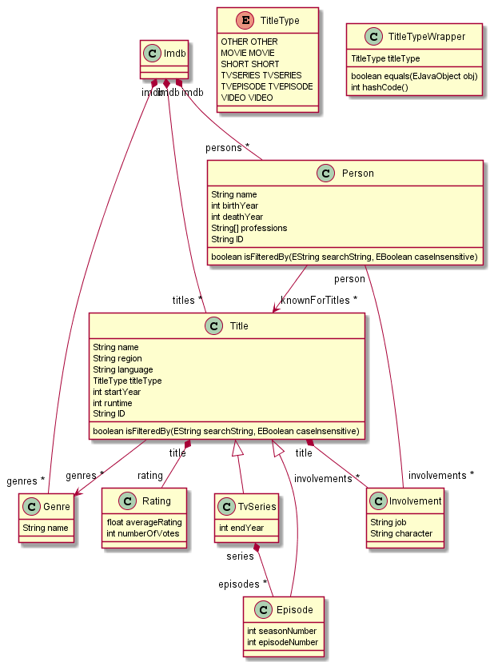
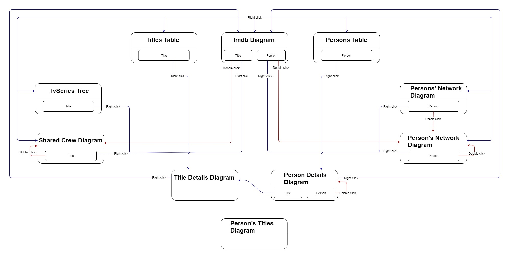

# TDT4250-Semester-Project
This project was created as part of the course TDT4250 Advanced Software Design at NTNU. The project uses a movie dataset, and can be used to edit and analyse the data, as well as showing connections between different kinds of data.

## Datasets
This project uses IMDb's datasets found at https://www.imdb.com/interfaces/. From these, we have generated some subsets using Python, which applies a region filter - showing only titles from the US, as these are more likely to be easily readable. An exception to this filtering, is `tvEpisode`s - these can be from any region, but must be connected to a `tvSeries` originating in the US. The remaining subsets are filtered by what is referenced from the region-filtered titles.

We recommend using these generated subsets, which can be downloaded from https://drive.google.com/open?id=1JdSAdLa_Nm8XGovUJyuULpH3YzL77Azv. The reason for this is that the main IMDb datsets use a different naming scheme, and the naming of the files in `dataset.zip` is already correct. In addition, we've also added a prepared XMI file called `Imdb.imdb`, as parsing the datasets and serializing to XMI uses a massive amount of memory, and can crash on some computers. If you want to run generate these subsets yourself, you should add an argument to JVM to increase the maximum memory available to 4.5-5 GB of RAM.

## Requirements
* Sirius: https://www.eclipse.org/sirius/download.html (follow the marketplace guidelines)
* Eclipse with Modeling tools: https://www.eclipse.org/downloads/ (select *Eclipse Modeling tools* during installation)
* Acceleo: https://marketplace.eclipse.org/content/acceleo

## Importing the project
You can import the project by opening a new Eclipse Workspace - preferably located in the root folder of a clone of this repository, clicking *Open Projects from File System*, and then choosing the mentioned root folder.

## Processing the datasets
First, you can choose to either use our subsets, or use the datasets available from IMDb. However, when downloading the IMDb datasets, they will need to be placed in `/imdb/src/imdb/dataset/`, and renamed to match the following:
* `name.basics.tsv` -> `persons.tsv`
* `title.basics.tsv` -> `titles.tsv`
* `title.ratings.tsv` -> `ratings.tsv`
* `title.principals.tsv` -> `involvements.tsv`
* `title.episode.tsv` -> `episodesDetails.tsv`

When these are placed correctly, you can run `DatasetDeserializer.java` located in `/imdb/src/imdb/dataset/`. This will parse the `.tsv` files and serialize them to a single XMI file. Currently, the deserializer is set to choose 10 random `tvSerie`s, 5 `movie`s, 5 `short`s1 and 5 `video`s, and all the information, episodes and people that are connected to these. These numbers can be changed in the `deserialize()` function. We recommend never going above 50 of each, as many computers will struggle viewing anything more in the Sirius viewpoints that show large amounts of data. Remember that you might need to increase the amount of RAM available, as mentioned in the beginning. We have not attempted to run this on the full datasets.

After being run, the XMI will be named `Imdb.imdb` and placed in `/imdb/src/imdb/dataset/`. 
Move this file to `/imdb.sirius.editor.model/`.

If you're using our prepared XMI, move `Imdb.imdb` from the ZIP file to `/imdb.sirius.editor.model/`.

## Running Sirius
Now that the dataset has been prepared, you are ready to show the data in the Sirius viewpoints. To do this, click 
`Run -> Run Configurations -> Eclipse Application -> Run`

When the new workspace has opened, do the following:
`Import Projects -> General -> Existing Projects into Workspace -> Browse -> *Root folder of the project directory* -> Select only imdb.odesign & imdb.sirius.editor.model -> Finish`

To create the first main IMDb diagram, go into 
`imdb.sirius.editor.model -> Imdb.imdb -> Right click Imdb -> New Representation -> Imdb Diagram -> Finish -> OK`

The viewpoint should now open. From here you can navigate to all other different viewpoints, trees and tables available. See the flowchart at the bottom to see the navigation options.

## Issues Identified
Sometimes, the TV Series tree won't render all TV series; we believe this is due to the viewpoint rendering quicker than the Java services code can run. If the tree is empty, go into the odesign file located at  `imdb.odesign/descriptions/odesign.odesign` 
Under  `imdb_viewpoint->TVseries tree->Imdb->TVseries branch->Season branch`  In Season Branch's Semantic Expression, make some changes that have no effect, like adding a space to `[self.getSeasons()/]`, and save. Going back to the tree viewpoint and collapse the IMDb view, and expand it, it should now properly render TV series with seasons and episodes. In addition, some TV series can have thousands of episodes causing the TV series tree to take quite a long time to load.

## Ecore Model
This is the model used in the project:
 

## The Sirius Editor
### Creation Tools
In the IMDb Diagram, you can find tools for creating new objects. The tools are displayed in the Palette view on the right side of the screen. Choose an object creation tool, click at an empty space in the IMDb Diagram and fill in the fields in the Dialog Box. It is also possible to create an object by hovering over an empty space in the IMDb Diagram, and clicking on one of the diamonds that will appear. Object properties can be edited in the Properties view.

### Navigation
The user can navigate through the different representations when using the Sirius editor in the runtime Eclipse. The boxes represent the different representations, and the small boxes inside represent the different elements which can be clicked in order to navigate. The user can `right click -> Navigation -> *Chosen representation*`, or `right click -> New/Open -> *Chosen representation*`.

### Filtering
When inside a node diagram, the user can press the **Filter** button () to display a dropdown of the filters available in that diagram. Three different filters are available:
* Filtering titles by title type
* Searching for title names
* Searching for person names
